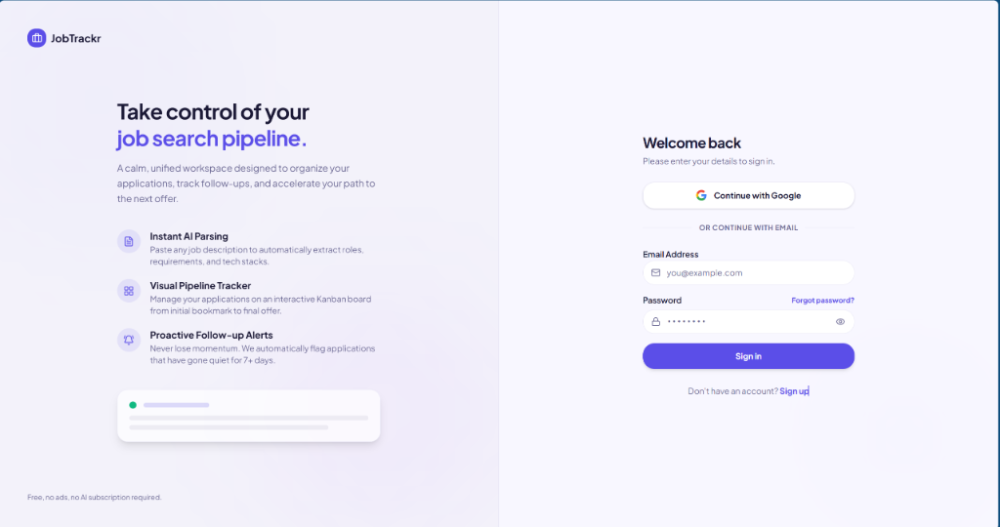

<div align="center">

# JobTrackr

**The smart, zero-cost job application tracker built for developers.**

Paste a job description. Get instant data extraction, a Kanban pipeline, and role-matched interview questions — no AI APIs, no subscriptions, no spreadsheets.

[](https://jobtrackr.hafizfaruqi.my)
[](https://nextjs.org)
[](https://react.dev)
[](https://www.typescriptlang.org)
[](https://supabase.com)
[](LICENSE)

<br />



</div>

---

## 🧩 The Problem

Job hunting is chaotic. Most developers end up juggling:

- 📊 Messy spreadsheets that go stale
- 🤔 Forgetting which stage each application is at
- 😰 No idea what to prepare for each interview
- 🔔 Missing follow-up windows because there's no reminder

**JobTrackr solves all of this in one clean, focused app.**

---

## ✨ Features

### 🔍 Smart JD Parser
Paste a raw job description **or just the posting's URL**, and JobTrackr extracts:
- Company name, role title, salary range, and location
- Tech tags (React, Node.js, SQL, Docker, etc.) via an alias-aware skills dictionary
- Custom tags you've taught it — it learns from you over time

> **Zero AI API calls.** All parsing runs client-side using regex heuristics and a curated skills dictionary — instant feedback, no spinners, no cost.

**Paste a link instead.** Drop in a job URL and the server fetches the page, then works down three levels of confidence:

| Level | Source | Used when |
|-------|--------|-----------|
| 1 | `JobPosting` JSON-LD | The board publishes structured data (Lever, Maukerja, Ricebowl) |
| 2 | Open Graph metadata | No JSON-LD, but the page declares `og:title` etc. (LinkedIn) |
| 3 | Scoped page text | Neither — the posting container is isolated, then parsed |

Level 3 never reads the whole page. The posting's own container is located first (`description__text`, `#jobDescriptionText`, `data-automation`, then `<article>` / `<main>`), so a "similar jobs" sidebar can't contribute another job's salary or unrelated tech tags to your entry.

When a field can't be determined with confidence, it's **left blank** rather than filled with a guess — an empty box is easier to catch than a plausible wrong answer.

> URL fetching is rate-limited per user, restricted to `https:`, and guarded against private/internal addresses. Auth-walled sites (Indeed, MyFutureJobs) fall back to manual entry with your link preserved.

---

### 📋 Kanban Pipeline
A drag-and-drop board that mirrors your real hiring funnel:

```
Saved → Applied → Interview → Offer → Rejected
```

- The dragged card is lifted into an overlay layer so it tracks the cursor exactly and is never clipped when crossing columns
- The column under the cursor highlights, and the card's original slot stays open as a dimmed placeholder
- On touch devices a short long-press starts the drag, so the board still scrolls normally
- Dropping a card into **Rejected** prompts for a reason (so you can spot patterns over time)
- Filter and search across all your applications in one view

---

### 📊 Dashboard Weekly Stats
Four at-a-glance tiles on your dashboard:

| Tile | What it shows |
|------|---------------|
| 📤 Applied This Week | New applications in the last 7 days |
| 🎤 Active Interviews | Jobs currently in the Interview stage |
| 🎉 Offers | Jobs that reached the Offer stage |
| ❌ Rejected This Week | Rejections in the last 7 days |

---

### 🎯 Interview Prep Panel
Open any job → see a curated list of interview questions matched to its tech tags.

- Technical questions per stack (React, TypeScript, Node.js, SQL, etc.)
- Universal behavioral questions included for every job
- Each question comes with a **preparation tip**
- Add your own inline notes per question

> Powered entirely by `lib/interview-questions.ts` — a local curated bank. No API latency.

---

### ⏰ Follow-up Reminders
JobTrackr flags any applied job with **no status update after 7 days**:
- A badge count appears in the sidebar
- A dedicated `/reminders` page lists all stale applications
- No cron job or push notifications — runs client-side on load

---

### 👤 User Profile & Privacy
- Edit your display name and upload an avatar
- **Export all your data** as a JSON file (your data, always yours)
- **Delete your account** with a single self-service action

---

## 🛠 Tech Stack

| Layer | Technology | Version |
|-------|-----------|---------|
| Framework | [Next.js](https://nextjs.org) (App Router) | 16.x |
| UI Runtime | [React](https://react.dev) (with React Compiler) | 19.x |
| Language | [TypeScript](https://www.typescriptlang.org) | 5.x |
| Styling | [Tailwind CSS](https://tailwindcss.com) | 4.x |
| UI Components | [shadcn/ui](https://ui.shadcn.com) | latest |
| Drag & Drop | [@dnd-kit](https://dndkit.com) | 6.x |
| Animations | [Framer Motion](https://www.framer.com/motion) | 12.x |
| Database | [Supabase](https://supabase.com) (PostgreSQL) | JS v2 |
| Auth | Supabase Auth — Email + Google OAuth | built-in |
| Icons | [Lucide React](https://lucide.dev) | latest |
| Date Handling | [date-fns](https://date-fns.org) | 4.x |
| Deployment | [Vercel](https://vercel.com) | — |

---

## 📁 Project Structure

```
jobtrackr/
├── app/
│   ├── (auth)/             # Login page & OAuth callback
│   ├── (dashboard)/        # Protected shell: sidebar + topbar
│   │   ├── dashboard/      # Kanban board
│   │   ├── jobs/           # Job list, new job form, job detail
│   │   └── reminders/      # Stale application flags
│   └── api/jobs/           # REST API: CRUD for jobs
├── components/
│   ├── kanban/             # Board, Column, JobCard
│   ├── jobs/               # JobForm, ParseInput, StatusBadge
│   ├── prep/               # PrepPanel, QuestionCard
│   ├── layout/             # Sidebar, Topbar, MobileNav
│   └── ui/                 # shadcn auto-generated components
├── lib/
│   ├── parser.ts           # Client-side JD text parser
│   ├── extract/            # URL fetch → JSON-LD, Open Graph, content region
│   ├── interview-questions.ts  # Curated question bank
│   ├── reminders.ts        # Stale job detection logic
│   └── supabase/           # Browser + server clients
├── contexts/               # JobsProvider, TagsProvider
├── hooks/                  # useJobs, useParser, useReminders
└── types/                  # Shared TypeScript interfaces
```

<details>
<summary><strong>Inside <code>lib/extract/</code></strong></summary>

| File | Responsibility |
|------|----------------|
| `fetch-page.ts` | Fetches the URL with a byte cap, timeout, and manual redirect re-validation |
| `url-guard.ts` | Rejects non-`https:`, credentials in the URL, and private/internal hosts |
| `jsonld.ts` | Reads `JobPosting` structured data — the highest-confidence source |
| `metadata.ts` | Open Graph fallback for boards that ship no JSON-LD |
| `content-region.ts` | Isolates the posting container so page chrome is never parsed |
| `html-to-text.ts` | Flattens HTML to text, dropping script/style/nav/footer |
| `rate-limit.ts` | Per-user request throttle |
| `errors.ts` | Typed error codes mapped to human-readable copy |

</details>

---

## 🚀 Getting Started

### Prerequisites

- Node.js 20+
- A [Supabase](https://supabase.com) project (free tier works)

### 1. Clone the repository

```bash
git clone https://github.com/Hafiz-Mhf/jobtrackr.git
cd jobtrackr
```

### 2. Install dependencies

```bash
npm install
```

### 3. Set up environment variables

```bash
cp .env.local.example .env.local
```

Fill in your Supabase credentials:

```env
NEXT_PUBLIC_SUPABASE_URL=https://your-project.supabase.co
NEXT_PUBLIC_SUPABASE_ANON_KEY=your-anon-key
SUPABASE_SERVICE_ROLE_KEY=your-service-role-key
NEXT_PUBLIC_APP_URL=http://localhost:3000
```

### 4. Set up the database

Run the following SQL in your Supabase SQL editor:

<details>
<summary><strong>Click to expand — Full database schema</strong></summary>

```sql
-- Profiles (auto-created on signup via trigger)
create table public.profiles (
  id          uuid primary key references auth.users(id) on delete cascade,
  full_name   text,
  avatar_url  text,
  created_at  timestamptz not null default now(),
  updated_at  timestamptz not null default now()
);

alter table public.profiles enable row level security;
create policy "select own profile" on public.profiles for select using (auth.uid() = id);
create policy "update own profile" on public.profiles for update using (auth.uid() = id);
create policy "insert own profile" on public.profiles for insert with check (auth.uid() = id);

-- Jobs
create table public.jobs (
  id               uuid primary key default gen_random_uuid(),
  user_id          uuid references auth.users(id) on delete cascade not null,
  company          text not null,
  role             text not null,
  url              text,
  description      text,
  status           text not null default 'saved'
                   check (status in ('saved','applied','interview','offer','rejected')),
  salary_range     text,
  location         text,
  source           text,
  rejection_reason text,
  rejected_at      timestamptz,
  tags             text[] not null default '{}',
  notes            text,
  applied_at       timestamptz,
  last_updated     timestamptz not null default now(),
  created_at       timestamptz not null default now()
);

alter table public.jobs enable row level security;
create policy "Users can select their own jobs" on jobs for select using (auth.uid() = user_id);
create policy "Users can insert their own jobs" on jobs for insert with check (auth.uid() = user_id);
create policy "Users can update their own jobs" on jobs for update using (auth.uid() = user_id);
create policy "Users can delete their own jobs" on jobs for delete using (auth.uid() = user_id);

create index jobs_user_id_idx on jobs (user_id);
create index jobs_status_idx on jobs (status);

-- User Tags (custom tags learned per user)
create table public.user_tags (
  id         uuid primary key default gen_random_uuid(),
  user_id    uuid not null references auth.users(id) on delete cascade,
  tag        text not null,
  created_at timestamptz not null default now()
);

create unique index user_tags_user_tag_lower_idx on public.user_tags (user_id, lower(tag));
create index user_tags_user_id_idx on public.user_tags (user_id);

alter table public.user_tags enable row level security;
create policy "user_tags_select_own" on public.user_tags for select using (auth.uid() = user_id);
create policy "user_tags_insert_own" on public.user_tags for insert with check (auth.uid() = user_id);
create policy "user_tags_delete_own" on public.user_tags for delete using (auth.uid() = user_id);
```

</details>

### 5. (Optional) Enable Google OAuth

In your Supabase dashboard → **Authentication → Providers → Google**:
- Add your Google OAuth Client ID and Secret
- Set the redirect URL: `https://your-project.supabase.co/auth/v1/callback`
- In Google Cloud Console, add the same URL to your allowlist (no wildcards)

### 6. Start the development server

```bash
npm run dev
```

Open [http://localhost:3000](http://localhost:3000) and start tracking! 🎉

---

## 🧪 Running Tests

```bash
npm run test
```

Tests use [Vitest](https://vitest.dev) — 186 tests across 14 files, covering the client-side parser, the URL extraction pipeline (JSON-LD mapping, Open Graph, content-region isolation, HTML flattening, URL guards, rate limiting), reminder detection, stats, validation, and tag learning.

The extraction tests are regression-driven: each one pins a failure seen against a real job posting, so the fixtures read like a list of ways job boards break naive scraping.

---

## 📦 Deployment

JobTrackr is designed to deploy on **Vercel** with zero config:

1. Push your fork to GitHub
2. Import the repository on [vercel.com](https://vercel.com)
3. Add your environment variables in the Vercel dashboard
4. Deploy — Vercel picks up `next.config.ts` automatically

Every `git push origin main` triggers an automatic redeploy.

---

## 🔒 Security

JobTrackr takes data security seriously:

- **Row-Level Security (RLS)** — every Supabase table enforces `auth.uid() = user_id` at the database level
- **Session via `@supabase/ssr` cookies** — httpOnly, Secure, SameSite=Lax; no tokens in localStorage
- **Server-side validation** — all API input is validated and capped server-side, independent of RLS
- **No `dangerouslySetInnerHTML`** — user-supplied text is always rendered as plain JSX
- **Generic auth error messages** — login errors never reveal whether an email exists

---

## 🗺 Roadmap

- [x] **Paste a job URL** — fetch and extract without copying the description by hand
- [ ] **Chrome Extension** — capture postings from auth-walled boards a server fetch can't reach
- [ ] **CSV Import** — migrate your existing spreadsheet in seconds
- [ ] **Email Reminders** — opt-in follow-up nudges sent to your inbox
- [ ] **Application Analytics** — response rate, average time-to-response by source
- [ ] **Team Mode** — share a pipeline with an accountability buddy

---

## 🤝 Contributing

Contributions are welcome! Please open an issue first to discuss major changes.

```bash
# Fork → clone → create a feature branch
git checkout -b feat/your-feature

# Make changes, then
npm run lint
npm run test

# Open a pull request
```

---

## 📄 License

MIT © [Hafiz Faruqi](https://github.com/Hafiz-Mhf)

---

<div align="center">

Built with ☕ and mild job-hunt anxiety.

**[Live Demo](https://jobtrackr.hafizfaruqi.my) · [Report a Bug](https://github.com/Hafiz-Mhf/jobtrackr/issues) · [Request a Feature](https://github.com/Hafiz-Mhf/jobtrackr/issues)**

</div>
